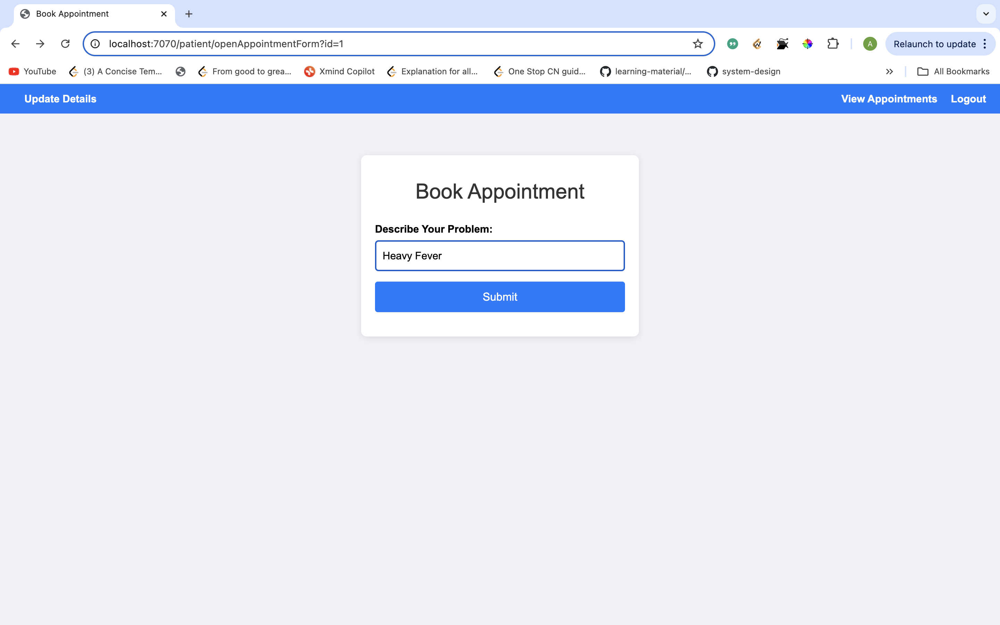

# Hospital Management System (HMS)

A Spring Boot-based Hospital Management System with microservices architecture for managing patients, doctors, and appointments. This project includes user authentication, data storage, and RESTful APIs for seamless integration.

## Features

- **Microservices Architecture**: Separate services for patients, doctors, and appointments.
- **User Authentication**: Secure login for doctors, patients, and admin.
- **Appointment Management**: Book, view, and manage appointments.
- **Doctor Availability**: Manage doctor availability and schedules.
- **Patient Records**: Maintain patient information and history.
- **Admin Dashboard**: Admin functionalities to manage users and view system statistics.

## Technologies Used

- **Backend**: Spring Boot, Spring Data JPA, Spring Security, Hibernate
- **Frontend**: Thymeleaf, HTML, CSS, JavaScript
- **Database**: MySQL
- **Microservices Communication**: RestTemplate
- **Build Tool**: Maven

## Application Views

### 1. Application Home
This is the landing page of the application where users can navigate to different sections like patient login, doctor login, and admin login.

### 2. Patient Home
Dashboard for patients to manage their profiles and view medical records or upcoming appointments.

### 3. Admin Home
Admin dashboard to manage doctors, patients, appointments, and other administrative tasks.

### 4. Book Appointment
Interface for patients to book an appointment with a doctor based on availability.

### 5. Patient's Appointment List
View for patients to see the list of their booked appointments.

### 6. Doctor's Appointment List
View for doctors to see the list of their scheduled appointments.

### 7. Doctor Availability Form
Form for doctors to set or update their availability.

## Getting Started

1. Clone the repository: `git clone https://github.com/yourusername/repositoryname.git`
2. Navigate to the project directory: `cd repositoryname`
3. Follow the setup instructions to get the microservices up and running.

